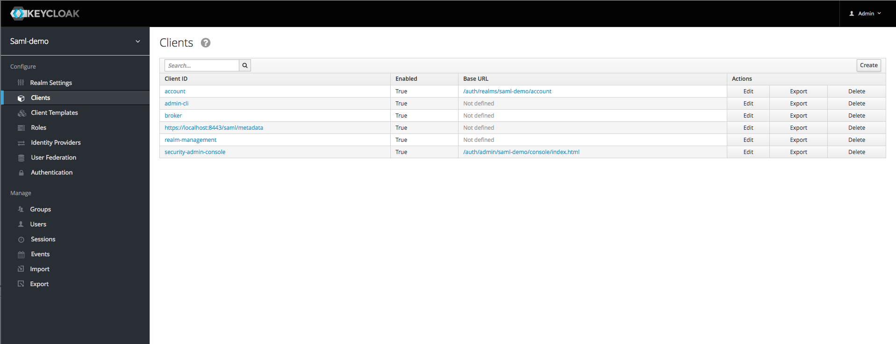

## Set up a test Keycloak instance

#### Basic setup
1. Access to an instance of Keycloak *or Red Hat SSO* is required (these steps assume that Docker is available and will be used for Keycloak).
1. Run the run-keycloak.sh script
```
src/main/run-keycloak.sh
```
3. Navigate to [https://localhost:18443/auth/admin/](https://localhost:18443/auth/admin/)
1. Sign in as the *admin* user with the password *admin*
1. Hover around the Master Realm in the upper left corner and select "Add realm"
1. Next, click the Select file button to the right of the "Import" label.
1. Navigate to the src/main/docker directory of this project's directory and select the saml-demo-realm.json file.
1. Click the Create button to create the realm.
1. Your realm should look like this 
1. Next, add a test user by clicking the Users link on the left under the Manage section.
1. Click the Add user button on the far right.  Enter the desired user information and create the user.
1. Select the credentials tab to enter a password for the newly created user.

## Certificate setup

1. Generate a keystore and key in `src/main/resources/saml` with password `secret`:


## Running the app

1. To run the application from the command line, change to the samples/keycloak-sample directory and then enter the following
```
./gradlew clean bootRun
```
2. Navigate to [https://localhost:8443/hello](https://localhost:8443/hello)
1. You should be prompted for a login.
1. Enter the username and password that was created above.

## Issues


Caused by: org.opensaml.saml2.metadata.provider.MetadataProviderException: No IDP was configured, please update included metadata with at least one IDP
	at org.springframework.security.saml.metadata.MetadataManager.getDefaultIDP(MetadataManager.java:781)